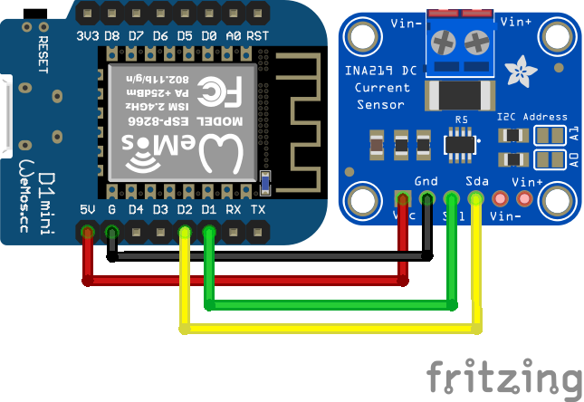
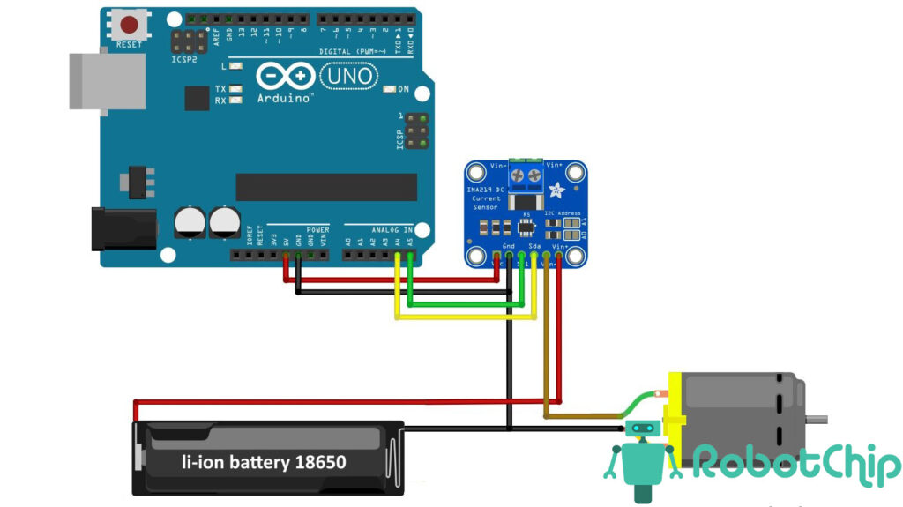
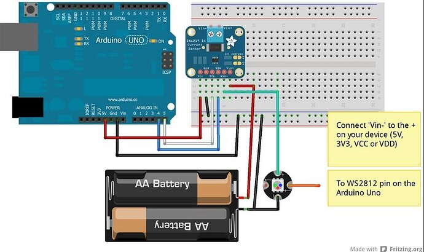

# Power meter

Простой power meter основанный на ina219, wemos d1 mini и oled shield (0.66").

## Схема подключения



```
SDA (INA219 / OLED) => D2 (на Wemos D1 Mini)
SCL (INA219 / OLED) => D1 (на Wemos D1 Mini)
          VCC / VIN => 3V3 или 5V (в зависимости от питания INA219 и OLED)
                GND => G (общая земля)
```





```
плюс питания =>  Vin+
выход с платы Vin- => плюс нагрузки
```

## TODO

- [x] software
- [ ] test in hardware
- [ ] 3d printed case
- [ ] Serial plotter with ProcessingGrapher
